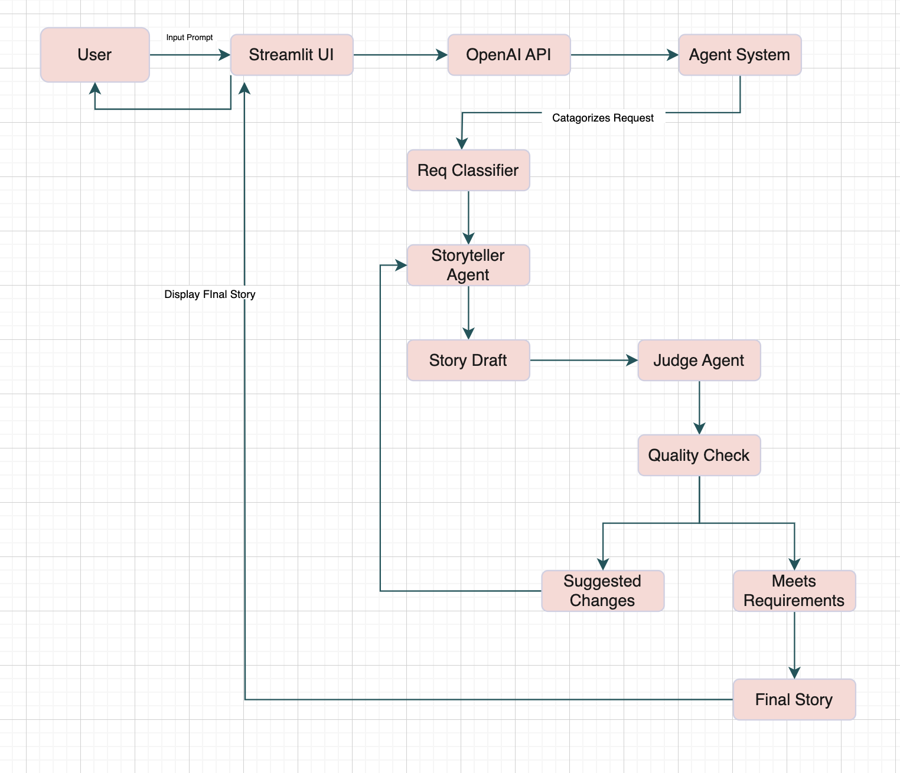

# Bedtime Story Generator

This project uses a multi-agent system powered by an LLM to generate safe, and imaginative bedtime stories for children aged 5-10. It is designed to ensure stories are of high quality and are appropriate for the intended audience.

## Getting Started
Follow these steps to set up and run the project locally.

## Prerequisites
- Python 3.7+ installed on your machine.

- An OpenAI API key.

## Installation
Clone this repository to your local machine:

- git clone [your-repository-url]
- cd [your-project-folder]

## Install Dependencies

pip install -r requirements.txt

## Set up your OpenAI API Key.

Create a file named .env in the root directory of the project.

Add your API key to this file in the following format:

OPENAI_API_KEY="your-api-key-here"

## Running the Project
1. To run the story generator in your terminal, simply execute the main.py script:

    python main.py

2. To run the project with Streamlit UI execute:

    streamlit run app.py

The script will guide you through the process of choosing a story category or writing a custom prompt.

## How It Works: The Agent System
The core of this project is a sophisticated multi-agent system that works collaboratively to generate and refine a story. The process is broken down into several key components, as illustrated in the block diagram below.

**1. Input Prompt**

The process begins with the User providing an Input Prompt to the system via the Streamlit UI or the command-line interface. This the request for a story.

**2. Request Classifier**

Before the story is created, the Agent System first uses a simple Request Classifier to categorize the user's request. This helps tailor the initial story generation prompt for better results. The classifier checks for keywords to determine if the story falls into categories like "Animal Adventure," "Space Exploration," "Fantasy Tale," or "Friendship Story." If no specific category is detected, it defaults to "General Bedtime."

**3. Storyteller Agent**

This is the creative engine of the system. The Storyteller Agent receives the classified request and uses a specialized prompt to generate the first Story Draft. Its prompt is designed to instruct the LLM to act as a children's author, focusing on a gentle tone, simple language, and a clear story arc.

**4. Judge Agent**

The Judge Agent acts as the quality control. It receives the Story Draft from the Storyteller and performs a Quality Check against a strict set of criteria. These criteria include:

- Age Appropriateness: Is the language and theme suitable for a 5-10 year old?

- Clarity and Flow: Is the story easy to understand?

- Tone: Is it gentle and calming?

- Safety: The most crucial check, ensuring no scary or inappropriate content.

**5. Iterative Feedback Loop**

This is where the magic happens! Based on its evaluation, the Judge Agent either provides Suggested Changes or determines that the story Meets Requirements.

If the story needs improvements, the suggestions are sent back to the Storyteller Agent. The Storyteller then generates a revised story draft, and the process repeats. This iterative loop ensures that the final story is refined and polished.

If the story meets all the requirements, the Judge approves it.

**6. Final Story**

Once the Judge Agent gives its approval, the refined story is considered complete. It is then displayed to the user as the Final Story, ready for bedtime.

This system demonstrates a powerful approach to using multiple Agents to create a robust and reliable application, with one agent focusing on creation and the other on safety and quality.